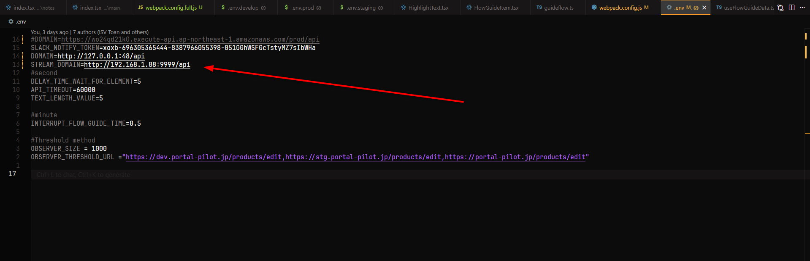
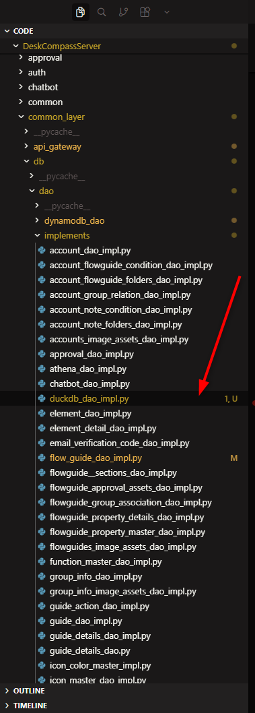
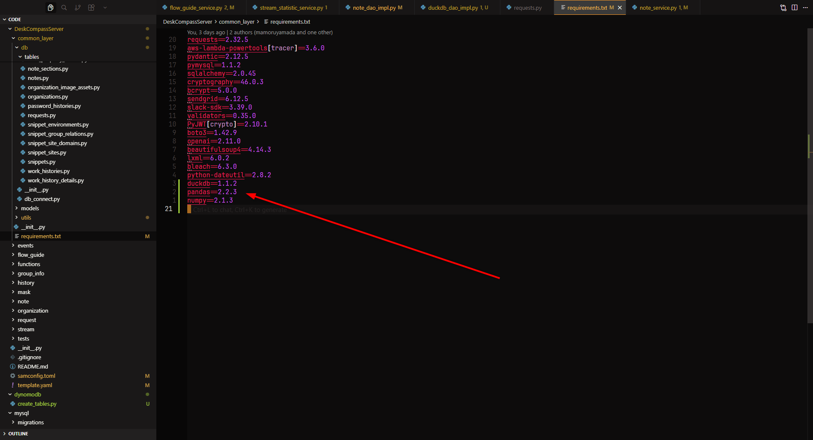
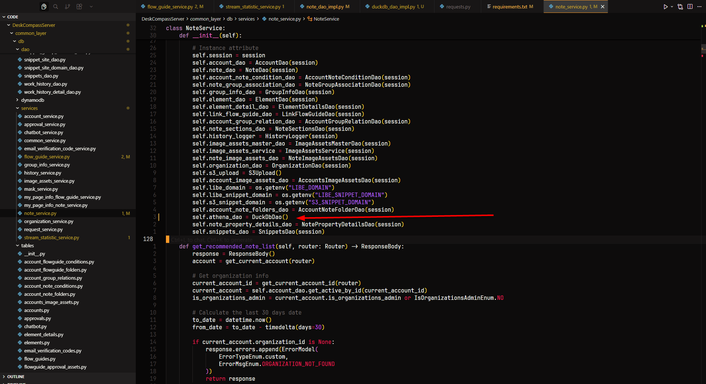
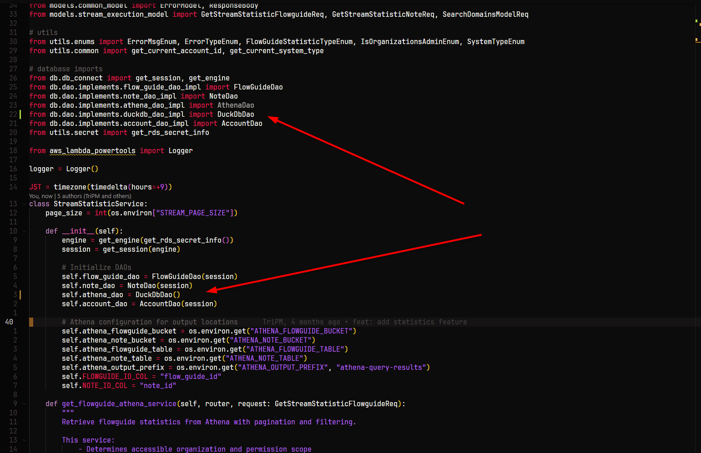

# Local DuckDB Setup Guide (Athena-Compatible)

This document describes how to configure **DuckDB** for local development as a drop-in replacement for **Athena**, while keeping existing DAO interfaces and analytics queries unchanged.

---

## Overview

In local mode:

* Frontend sends analytic events to a local backend endpoint
* Backend processes and queries data using **DuckDB**
* DuckDB DAO implements the same interface as Athena DAO
* No AWS Athena / Glue / S3 is required for local development

This allows fast, offline-friendly analytics development with minimal code changes.

---

## Step 1: Configure Frontend Event Streaming

Add the following environment variable to the **frontend `.env` file**:

```env
STREAM_DOMAIN=http://192.168.1.88:9999/api
```

### Explanation

* Ensures every execution or analytic event is sent to the specified endpoint
* Redirects event traffic to your **local API**
* Allows DuckDB to receive and process analytic events locally

> Make sure the IP and port match your local backend setup.

---

## Step 2: Add DuckDB DAO Implementation


Copy the DuckDB DAO implementation file:

```
duckdb_dao_impl.py
```

Place it under:

```
db/dao/implements/
```

### Explanation

* `DuckDbDao` implements the same interface as `AthenaDao`
* Existing analytics queries remain compatible
* Switching between Athena and DuckDB requires only changing initialization

---

## Step 3: Add Required Python Dependencies


Edit the following file:

```
common_layer/requirement
```

Add these dependencies **at the bottom**:

```txt
duckdb==1.1.2
pandas==2.2.3
numpy==2.1.3
```

### Explanation

| Package | Purpose                          |
| ------- | -------------------------------- |
| duckdb  | Local analytical database engine |
| pandas  | DataFrame-based query handling   |
| numpy   | Vectorized numeric operations    |

Placing them in `common_layer` ensures all related containers can access these libraries.

---

## Step 4: Replace Athena DAO with DuckDB DAO


### Example: `NoteService`

#### Before (Athena)

```python
self.athena_dao = AthenaDao()
```

#### After (DuckDB)

```python
self.athena_dao = DuckDbDao()
```

### Full Example (Excerpt)

```python
class NoteService:

    def __init__(self):
        engine = get_engine(get_rds_secret_info())
        session = get_session(engine)

        self.session = session
        self.account_dao = AccountDao(session)
        self.note_dao = NoteDao(session)
        self.account_note_condition_dao = AccountNoteConditionDao(session)
        self.note_group_association_dao = NoteGroupAssociationDao(session)
        self.group_info_dao = GroupInfoDao(session)
        self.element_dao = ElementDao(session)
        self.element_detail_dao = ElementDetailsDao(session)
        self.link_flow_guide_dao = LinkFlowGuideDao(session)
        self.account_group_relation_dao = AccountGroupRelationDao(session)
        self.note_sections_dao = NoteSectionsDao(session)
        self.history_logger = HistoryLogger(session)
        self.image_assets_master_dao = ImageAssetsMasterDao(session)
        self.image_assets_service = ImageAssetsService(session)
        self.note_image_assets_dao = NoteImageAssetsDao(session)
        self.organization_dao = OrganizationDao(session)
        self.s3_upload = S3Upload()
        self.account_image_assets_dao = AccountsImageAssetsDao(session)

        self.libe_domain = os.getenv("LIBE_DOMAIN")
        self.libe_snippet_domain = os.getenv("LIBE_SNIPPET_DOMAIN")
        self.s3_snippet_domain = os.getenv("S3_SNIPPET_DOMAIN")

        self.account_note_folders_dao = AccountNoteFolderDao(session)

        # Switch Athena to DuckDB for local analytics
        self.athena_dao = DuckDbDao()

        self.note_property_details_dao = NotePropertyDetailsDao(session)
        self.snippets_dao = SnippetsDao(session)
```

---

### Update Imports

Ensure imports are updated correctly:

```python
from db.dao.implements.duckdb_dao_impl import DuckDbDao
from db.dao.implements.athena_dao_impl import AthenaDao
```

You may keep both imports if you plan to switch implementations via environment variables later.

---

### Apply the Same Change in These Files

Repeat the DAO replacement in the following files:

#### Services

* `note_service`
* `flow_guide_service`
* `stream_statistic_service`

#### DAO Implementations

* `note_dao_impl`
* `flow_guide_dao_impl`

Replace every occurrence of:

```python
AthenaDao()
```

with:

```python
DuckDbDao()
```

---

## Step 5: Build and Run Local API

Rebuild and start the local API as usual:

```bash
sam build
sam local start-api
```

Existing aliases or scripts can be used if already configured.

---

## Notes

* This configuration is intended for **local development only**
* Production and staging environments should continue using Athena
* DuckDB provides fast, zero-setup analytical queries locally
* SQL behavior is largely Athena-compatible, but edge cases may exist

---

## Optional Improvements

* Add an environment-based switch (e.g. `USE_DUCKDB=true`)
* Configure a persistent local `.duckdb` file per service
* Add query compatibility tests between Athena and DuckDB
